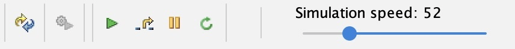
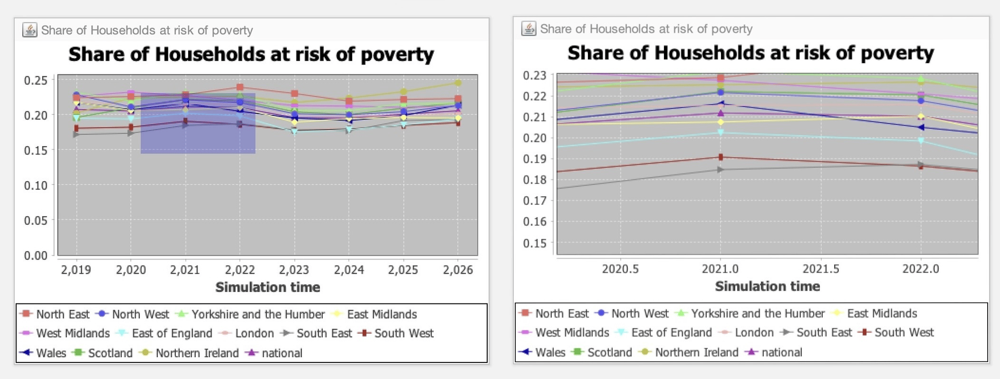

# The Graphical User Interface

## 1. Introduction
In this section, we discuss the different components that make up the JAS-mine Graphical User Interface (GUI).


SimPaths uses the JAS-mine interface for interactive single runs. Start it with `java -jar singlerun.jar`; use `-g false` for headless execution. There is no need to edit a demo start class or install an Eclipse project-generation plugin. See [Single Runs](single-runs.md) for the supported commands.

## 2. First GUI run with bundled training data

This procedure is for a fresh clone using the training data included with SimPaths. It creates the local database tables required by the model and then starts an interactive simulation. The training data are suitable for learning, testing, and development, but results produced from them should not be used for substantive analysis.

### 2.1 Launch the interface

Build the executable from the repository root if you have not already done so:

```bash
mvn clean package
```

Then launch the single-run interface:

```bash
java -jar singlerun.jar
```

On a fresh clone, complete the setup dialogs before clicking **Build simulation model** in the main interface. The bundled initial-population files are source data from which SimPaths must first construct its local H2 input database.

### 2.2 Choose the start-up processes

In the **Start-up Options** dialog, select these three options:

- **Change simulation start year**
- **Use UKMOD Light to alter description of tax and benefit systems**
- **Load new input data for tax and benefit systems**

Leave **Load new input data for starting populations** and **Select tax and benefit systems for analysis** unselected, as shown below, then click **next**.


### 2.3 Select the start year

Select **2019**, then click **next**.


The 2019 start year is important when using the bundled training data because those data were generated for 2019. If no year is selected, SimPaths uses the default start year of 2011, for which the training database has no household table.

!!! warning "Do not use the default 2011 start year with training data"
    If setup is skipped or 2019 is not selected, building the model can fail with `Table "HOUSEHOLD_UK_2011" not found`. Return to the start-up dialogs, select the setup options above, and choose 2019.

### 2.4 Build the input database

The database build now starts. A progress window appears, and the console or IDE output reports `Building database tables for starting populations`.


This is normally quick with the bundled training data. It can take longer when authorised research data are being processed, so allow the process to finish before interacting with the next dialog.

### 2.5 Build the policy schedule

When the policy-selection window appears, leave the policy systems unselected and click **Build new Policy Schedule**. Wait while SimPaths completes the remaining setup and opens the main JAS-mine interface.

### 2.6 Build and start the simulation

In the main interface:

1. Click **Build simulation model**.
2. When the model has finished building, click the green **Start simulation** button.



The chart panels should begin updating as the simulation runs, while setup and run messages appear in the output stream. The controls are described in more detail in [Simulation Control Pane](#32-simulation-control-pane).

!!! tip "Later runs"
    Once the input database and policy schedule have been built, they can normally be reused. Repeat setup after replacing input data, changing donor policy files, or changing the policy schedule.

## 3. Components

### 3.1 Menus


There are three menu tabs at the top of the JAS-mine:

* Simulation – this menu contains a list of the buttons that appear in the Simulation Control Pane below the Menu tabs, plus the simulation's engine status (which includes information about the simulation run number, random number seed and event list references).
* Tools – contains the '**[Database explorer](https://www.microsimulation.ac.uk/jas-mine/resources/cookbook/queries/)**' that opens up the web browser to interact with the simulation's input or output databases (if any).  This also includes the 'Print windows positions' tool that prints to the output stream window the co-ordinates of the corner positions of all widgets (parameter boxes and graphs) in the main graphical window.
* Help – features the 'About JAS-mine' option that opens up a window containing credits for JAS-mine and the terms of the GNU LESSER GENERAL PUBLIC LICENSE, in addition to information about the system environment being used to run JAS-mine simulations such as the memory allocated to the Java Virtual Machine and the version of Java.

### 3.2 Simulation Control Pane


Below the Menu tabs are the simulation control buttons. The user can easily discover the meaning of each of the buttons by hovering the mouse pointer over each button. We describe the actions associated with each button below, ordered from left to right:

* **Restart simulation model**
* **Build simulation model** – builds the simulation model so that it can be executed.
* **Start simulation** – starts the execution of the simulation (note that the model must be built before it can be executed – this is done by clicking on the 'Build simulation model' button to the immediate left).
* **Execute next scheduled action** – if the simulation is paused (see Pause button to the immediate right), by clicking on this button, the user can execute the next action scheduled in the simulation. This allows the user to perform a step-by-step execution of the simulation. To continue the simulation as normal, press the 'Start simulation' button again.
* **Pause simulation** – pauses the simulation model. Press the 'Start simulation' button to continue the simulation.
* **Update parameters in the live simulation** updates exposed settings while the model is running. Only subsequently read values take effect; see [Parameter Boxes](#33-parameter-boxes) for the distinction between initialisation and live settings.

In addition, the toggle box **'Turn off database'** disables JAS-mine's [object-relational mapping](https://www.microsimulation.ac.uk/jas-mine/resources/focus/object-relational-mapping/) to the relational database management system. In this way, simulations with this toggle box ticked are running JAS-mine 'lite' – a lighter version without any of the database machinery. This may be useful if, for example, the user has no need of input or output databases in their simulation, and they want a way of reducing the memory requirements of their simulation and to potentially increase the speed of execution. Note that an exception will be thrown if a model requiring data from an input database is attempted to be built whilst the 'Turn off database' toggle box is ticked.

The sliding scale on the right labelled **'Simulation speed'** adjusts the real-time speed in which the simulation is executed. The default speed is set to the maximum (and so is only limited by the processor speed of the computer on which the simulation is running), however the simulation can be slowed down by dragging the slider to the left – this may be useful for example when demonstrating a model to an audience when it is desired to slow down the updates of the graphs.

### 3.3 Parameter Boxes

A JAS-mine model's *[GUI parameters](https://www.microsimulation.ac.uk/jas-mine/resources/cookbook/gui-parameters/)* appear in the parameter boxes below the Simulation Control Pane.  One parameter box for each of the '[Model-Collector-Observer](https://www.microsimulation.ac.uk/jas-mine/resources/focus/model-collector-observer/)' manager classes is displayed, as long as there are any variables in each of the manager classes that have the `@GUIparameter` annotation.


The description of a GUI parameter can be observed by hovering the mouse pointer over the value, upon which a yellow box containing the description appears if it has been defined as an attribute in the `@GUIparameter` annotation where the variable is declared, e.g.:
```java
@GUIparameter(description = "Simulated population size (base year)")
private Integer popSize = 50000;
```

Numeric fields use input boxes, Boolean fields use toggles, and enums can use category selectors. The controls shown depend on the revision; a historical screenshot is not an authoritative list of current settings.

Set initialisation parameters before building the model. For live changes, edit the value and click **Update parameters in the live simulation**. Only code that reads the updated value afterwards can respond. Changing `popSize` during a run does not recreate the starting population.

For code changes that expose a new setting, see [Add Parameters to the GUI](../developer-guide/how-to/add-gui-parameters.md).

### 3.4 Graphical Widgets (Charts)

Below the parameter boxes in the main pane with the blue background, a variety of graphics can be produced in the JAS-mine GUI, including time-series plots, histograms and geographical maps. For information on the currently supported graphics, see the JAS-mine GUI's Plot, Colormap and Space packages in the [API](https://www.microsimulation.ac.uk/jas-mine/resources/api/) documentation; for how to feed the graphical widgets, see the JAS-mine [statistical package](https://www.microsimulation.ac.uk/jas-mine/resources/tutorials/how-to-use-the-jasmine-statistical-package/).

The graphics do not immediately appear in the GUI when the JAS-mine project's Start class is executed; the project must be built first by clicking on the 'Build simulation model' button in the Simulation Control Pane.

The settings of a graphical widget can be adjusted by right clicking on it with the mouse pointer, and selecting the appropriate controls that are available for the type of widget. For example, the labels, line-type, colour and appearance of time series plots can be altered while running the simulation as shown below:


In addition, for a time series plot, it is possible to zoom in to areas of data points by left-clicking and dragging the mouse pointer diagonally downwards and to right in order to select a rectangle of area to enlarge. The left hand side of the figure below shows the rectangle created by dragging the mouse pointer (the mouse pointer is not shown), and the right hand side is the resulting enlarged chart. The user can zoom out again either by dragging the mouse pointer upwards or leftwards, or by right clicking and selecting 'Auto Range -> Both Axes' from the list of options.



Finally, the time series plots can be saved as a PNG file, printed or copied by right clicking on the chart and selecting the relevant option.

### 3.5 Output stream

The output stream is the white coloured window at the bottom of the GUI. It contains the system and debugger out-stream data that would be printed out to the Command Prompt (in Windows), the Terminal (Linux), or in Eclipse if running in batch mode without the GUI. Such output includes any data produced by `System.out.println()` or `System.err.println()` commands in Java, and also information about the creation of database tables when building the project. The stack trace of any exceptions thrown will be printed out. The buttons on top of the output stream window include an option to save the text to file.


